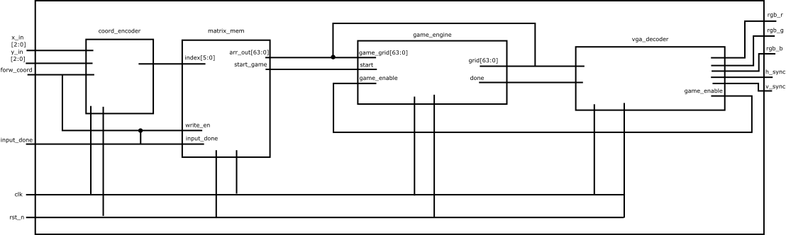

# 03-Game-of-Life

**Author:** Jakob Piller, Felix Repp, Konstantin Haidacher, Dejan Sovic

## Description

This project implements an **8x8 Conway's Game of Life cellular automaton** on custom hardware, with visual output provided through a VGA controller at 640x480 resolution and 60 Hz refresh rate. The system operates in two main modes: configuration and simulation, with a clear hardware flow from user input to VGA output.  

### Chip Architecture and Flow

1. **User Input (Configuration Mode):**  
   - Users set the initial state (Generation 0) manually using physical switches on the board.  
   - The **X and Y coordinates** of the cell to be activated are selected via **3-bit inputs**: `ui_in[4:2]` for X (0–7) and `ui_in[7:5]` for Y (0–7).  
   - The `uio_in[0]` signal is used to **activate a cell** at the selected coordinates in memory. Cells **cannot be deactivated**; mistakes require resetting the entire grid with `ui_in[0]` (User Reset) and restarting the configuration.  
   - Once the user completes the initial configuration, they assert `uio_in[1]` (Input Done) to confirm the grid is ready for simulation.  

2. **Encoder and Matrix Formation:**  
   - Every confirmed input passes through an **encoder module**, which converts the (X, Y) coordinates into a **single index** for the 64-bit representation of the 8x8 grid.  
   - These indices are collected in the **matrix_new module**, which assembles a full 64-bit array representing the initial grid state (`matrix_new[63:0]`).  
   - The resulting matrix is sent to the **GOL (Game of Life) module** once `uio_in[1]` is asserted.  

3. **Game of Life Processing:**  
   - The GOL module applies Conway’s rules to the current matrix. It is composed of the following submodules:  
     - **Top-Level Module:** Coordinates the simulation for each generation.  
     - **Neighbor Counter:** Counts the number of live neighbors for each cell.  
     - **Rule Engine:** Determines the next state of each cell based on standard Game of Life rules (birth, survival, death).  
   - After computing one generation, the updated matrix is forwarded to the VGA decoder.  

4. **VGA Output (Simulation Mode):**  
   - The **VGA decoder** converts the 64-bit matrix into RGB signals for the display.  
   - A **cell aging mechanism** enhances visualization: newly born cells appear green, while older cells gradually transition to pink/red, providing immediate visual feedback on the evolution and stability of patterns.  

### Key Features

- **Manual cell input via switches:** Users configure the initial 8x8 grid using 3-bit X and Y inputs, with activation-only functionality and a reset option for correcting mistakes.  
- **64-bit matrix representation:** Efficiently encodes the grid state for rapid computation and interfacing with the Game of Life logic.  
- **Modular architecture:** Clear separation of responsibilities across modules, including input encoding, matrix assembly, rule computation, and VGA output.  
- **Real-time simulation and visualization:** The system updates generations in real time, using a cell-aging mechanism to visually distinguish cell lifetimes.  
- **Open-source hardware toolchain:** The design is synthesized, simulated, and implemented using Yosys, LibreLane, and OpenROAD, demonstrating a fully open-source workflow from RTL to physical layout.  

This design demonstrates the transformation of a classical software-based cellular automaton into efficient, real-time hardware, enabling both hands-on interaction and high-resolution visual output.

## Pin List

| Pin | Direction | Description |
| :--- | :--- | :--- |
| `ui_in[0]` | Input | User Reset (clears the grid) |
| `ui_in[1]` | Input | Start Game (switches from input mode to simulation mode) |
| `ui_in[4:2]` | Input | X-Coordinate for manual pixel input (3 bits) |
| `ui_in[7:5]` | Input | Y-Coordinate for manual pixel input (3 bits) |
| `uio_in[0]` | Input | Set Pixel (writes the cell at X/Y to the memory) |
| `uio_in[1]` | Input | Input Done (confirms the initial grid is fully entered) |
| `uio_in[7:2]` | Input | Unused |
| `uo_out[0]` | Output | VGA V-Sync |
| `uo_out[1]` | Output | VGA Red (Bit 2) |
| `uo_out[2]` | Output | VGA Green (Bit 2) |
| `uo_out[3]` | Output | VGA Blue (Bit 2) |
| `uo_out[4]` | Output | VGA H-Sync |
| `uo_out[5]` | Output | VGA Red (Bit 3) |
| `uo_out[6]` | Output | VGA Green (Bit 3) |
| `uo_out[7]` | Output | VGA Blue (Bit 3) |
| `uio_out[7:0]` | Output | Unused (assigned to 0) |
| `uio_oe[7:0]` | Output | Bidirectional output enable (assigned to 0) |

## Diagram

