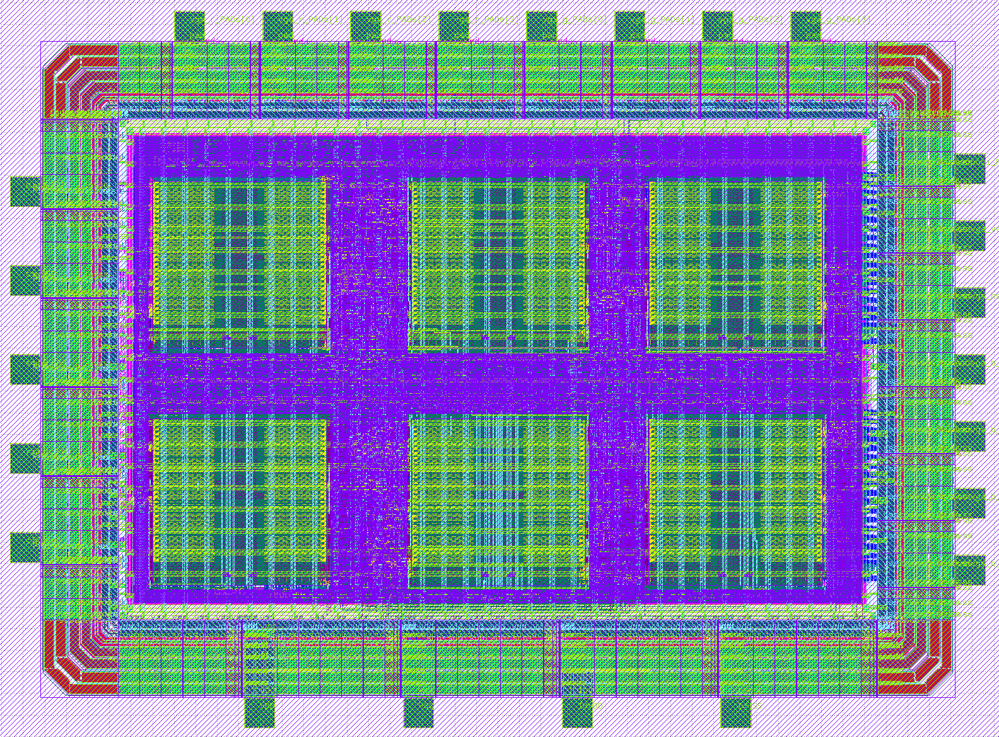

# 10-sandpile

**Authors**: Joel Adabunu, Robin Schönberg, Korbinian Wieser, Felipe Schubert Costa

## Description
The chip is a System on a Chip (SoC) that runs a simulation of the Abelian sandpile model. Simulation is configurable in drop mode, grid size, and speed via SPI and outputs the current simulation status via VGA. It can be started, stopped, or reset that way aswell. Self criticality is an essential topic in our lifes as it occurs in natural event, such as earthquakes, avalanches and so on. Due to the sandpile simulation displaying also self criticality it can help us get a better understanding for this topic.

## Pin list
| Pin | Usage | Description |
| --- | ----- | ----------- |
| sclk | input | SPI Serial Clock |
| cs | input | SPI Chip Select |
| pico | input | SPI Peripheral In, Controller Out (Data input) |
| poci | output | SPI Peripheral Out, Controller In (Data output) - currently unused |
| [3:0] vga_r | output | 4-bit Analog Red channel |
| [3:0] vga_g | output | 4-bit Analog Green channel |
| [3:0] vga_b | output | 4-bit Analog Blue channel |
| vga_hs | output | Horizontal Sync pulse |
| vga_vs | output | Vertical Sync pulse |

## Chip Architecture

## Chip Result
